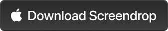

# Screendrop

> [!IMPORTANT]
> **Beta** - Screendrop is under active development. Expect rough edges, missing features, and breaking changes between releases. Feedback and bug reports are welcome via [GitHub Issues](https://github.com/fayazara/Screendrop/issues).

<p>
  <br/>
  <a href="https://github.com/fayazara/Screendrop/releases/latest/download/Screendrop.dmg">
    
  </a>
</p>

<p>
  <a href="https://github.com/fayazara/Screendrop/releases/latest">Latest release</a>
  ·
  <a href="https://github.com/fayazara/Screendrop/releases">All releases</a>
</p>

Screendrop is a native macOS menu bar app for taking screenshots, recording the screen, annotating captures, and sharing them when needed. It is built for a fast local workflow: capture something, preview it immediately, mark it up, save it, copy it, or upload it from the same floating preview.

The app is designed to stay out of the way. It runs as a menu bar utility with no main window, keeps a local capture history, and only talks to the network when you explicitly configure cloud sharing or check for updates.

## Install

### Download

1. Download the latest `Screendrop.dmg` using the button above, or from the [releases page](https://github.com/fayazara/Screendrop/releases/latest).
2. Open the DMG and drag **Screendrop** into your Applications folder.
3. Launch Screendrop. It lives in the menu bar — look for its icon in the top-right.

The download button always points at the most recent release, so the link stays current as new versions ship.

**Requirements:** macOS 26.4 or newer.

> On first launch macOS may warn that the app is from an unidentified developer. If so, right-click the app and choose **Open**, or allow it under **System Settings → Privacy & Security**.

### Homebrew

Install via the Homebrew tap:

```bash
brew install --cask fayazara/tap/screendrop
```

To update later:

```bash
brew upgrade --cask screendrop
```

(Screendrop also updates itself via Sparkle.)

## What It Does

- Capture the full screen, a selected window, or a selected area.
- Record the full screen, a selected window, or a selected area.
- Preview recent captures in a floating stack.
- Annotate screenshots with shapes, arrows, freehand drawing, text, numbered markers, blur, pixelate, and background styling.
- Trim and compress screen recordings.
- Save captures automatically to your chosen folder.
- Copy screenshots or recordings to the clipboard.
- Keep a local history of screenshots and recordings.
- Upload captures to your own Cloudflare-backed sharing setup.
- Check for app updates with Sparkle.

## Capture Workflow

Screendrop is controlled from the menu bar.

Default screenshot hotkeys:

- `Option + 1`: capture full screen
- `Option + 2`: capture window
- `Option + 3`: capture area

After a capture, Screendrop imports the file into its local history and shows a floating preview. From there you can copy, save, delete, annotate, edit a recording, or upload the capture if cloud sharing is configured.

Screenshots are captured at native display resolution. Annotation coordinates are stored independently from pixel size, then rendered onto the final image at export time.

## Recording Workflow

Screen recording supports display, area, and window sources. Screendrop can also show recording overlays such as mouse indicators and key press captions. Finished recordings are added to history and can be edited or compressed from the built-in video editor.

Video compression uses FFmpeg when available. Install it with Homebrew if you want conversion and compression features:

```bash
brew install ffmpeg
```

## Cloud Sharing

Screendrop does not require a paid backend. Cloud sharing is designed around a small Cloudflare Worker setup that can run on the free tier:

- A Cloudflare Worker receives authenticated uploads and returns share links.
- Cloudflare R2 stores the actual screenshot or recording files.
- Cloudflare D1 stores lightweight metadata for each uploaded capture.
- Screendrop only needs your Worker URL and upload token. It does not store R2/S3 credentials.

The companion Worker lives here:

[github.com/fayazara/screendrop-worker](https://github.com/fayazara/screendrop-worker)

[](https://deploy.workers.cloudflare.com/?url=https://github.com/fayazara/screendrop-worker)

### How Uploads Work

When you upload a capture:

1. Screendrop sends the file to your Worker with `PUT /api/upload`.
2. The Worker validates the upload token.
3. The Worker writes the file to R2 and records metadata in D1.
4. The Worker returns a share URL, which Screendrop copies to the clipboard and stores in local history.

The upload token is the only secret Screendrop needs. File storage and metadata stay in your own Cloudflare account.

### Cloud Setup

The fastest setup is from Screendrop:

1. Open **Settings -> Cloud**.
2. Copy the generated upload token.
3. Click **Deploy to Cloudflare**.
4. Paste the token when Cloudflare asks for the `UPLOAD_TOKEN` secret.
5. After deployment, copy your Worker URL back into Screendrop.
6. Click **Verify Connection**.

The deploy flow provisions the Cloudflare resources the Worker needs, including R2 and D1 bindings. If you are deploying manually, configure the Worker with the required R2 and D1 bindings and store the upload token as a Worker secret:

```bash
npx wrangler secret put UPLOAD_TOKEN
```

Screendrop's connection check calls the Worker setup and ping endpoints so it can verify the URL and token before you upload captures.

## Privacy Model

Screendrop is local-first.

- Captures are stored on your Mac by default.
- The upload token is stored in Keychain.
- The Worker URL is stored in app preferences.
- Cloud uploads only happen when you use the upload action.
- The app does not depend on a central Screendrop server.

## Building Locally

Requirements:

- macOS 26.4 or newer
- Xcode 26.4 beta toolchain
- Sparkle is resolved through Swift Package Manager

Build from the command line:

```bash
DEVELOPER_DIR=/Applications/Xcode.app/Contents/Developer xcodebuild build \
  -project Screendrop.xcodeproj \
  -scheme Screendrop \
  -configuration Debug \
  -destination "platform=macOS"
```

## Releasing

Screendrop includes a small Go release helper adapted from the Kaze release flow:

```bash
go run ./cmd/screendrop-release
```

It expects an exported `Screendrop.app` in `~/Downloads`, creates a DMG, signs it for Sparkle, updates `appcast.xml`, pushes the appcast commit, and creates a GitHub release.

## License

License information will be added before the first public release.
